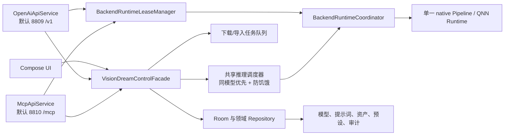

# Vision Dream 一加 13 极限优化与 MCP 控制 ExecPlan

- 目标平台：OnePlus 13 `PJZ110 / SM8750 / HTP V79 / 24 GB`
- 目标运行时：QAIRT `2.48.40.260702`
- 应用包：仅保留 `io.github.ddq.visiondream`

## 目标与结论

本方案不是“升级后跑通”方案，而是以一加 13 真机数据搜索 Vision Dream
在既定画质和可靠性约束下的局部性能上限，并交付可供 Agent 调试的受控 MCP
入口。性能部分必须同时交付两条 Pareto 曲线：

1. **单张极速**：最小化冷模型首张、热模型首张和第二张端到端延迟。
2. **持续极速**：最大化 30–60 分钟同模型串行生图吞吐，避免最高电压角
   导致提前热降频。

优先级固定为：正确性与画质不回退 > 不挂死和可取消 > 热生成延迟 >
持续吞吐 > 冷加载/切模型 > 内存与能耗。若一个候选只让第一张更快，却让
持续吞吐、画质或可靠性退化，则不属于“极限优化”。

继续沿用现有 OpenAI 图片 API，不接入 GenieX；同时新增 MCP Agent Control
Plane。OpenAI 路由、Bearer 鉴权语义、有界模型亲和队列、资产入库和临时
图片 URL 均保持兼容。MCP 使用独立的 Android Service、listener、端口、
鉴权和开关，不挂载到 `OpenAiHttpServer`；默认地址为
`127.0.0.1:8810/mcp`，OpenAI 默认使用 `8809`，两个端口均可独立配置。
两者只共享领域能力、模型 runtime 和推理队列，避免同时切模型或并发踩坏
QNN Pipeline。GenieX 只作为
OpenAPI、模型生命周期和错误结构的设计参考；将来增加真正的 LLM/VLM 聊天
能力时，再把 GenieX Android SDK 作为独立后端评估。

本方案只使用一个应用包，不引入基础版/过滤版或第二个 application ID。
一加 13 特化通过运行时 capability profile 和构建参数实现；其他设备走
保守回退。

## 当前基线

- 2026-07-28 已通过 USB 真机确认当前唯一设备为 OnePlus `PJZ110`，
  `SM8750`、Android 16/API 36、约 22.52 GiB 可寻址内存（24 GB 标称）。
  CPU 0–5 最高 3.5328 GHz，CPU 6–7 最高 4.32 GHz，GPU 为 Adreno 830。
- 当前 Thermal Status 为 0，设备具备 Perfetto v49 和 Simpleperf；安装包是
  debuggable 1.0，可进行 native/Java profiling。正式热稳态测试必须改用
  Wi-Fi ADB 并拔掉 USB，避免充电发热污染数据。
- `app/src/main/cpp/CMakeLists.txt` 默认使用 QAIRT `2.44.0.260225`。
- 已安装 APK 的 `libQnnHtp.so` Build ID 为 `v2.44.0.260225143659`，
  native worker 实际映射 V79 Stub/Skel，但并未使用 2.48 runtime。
- 本机 `/Users/likaixuan/Library/Android/qairt/` 当前只有 2.44 SDK；开始
  M2 前必须恢复官方 2.48.40 完整 SDK。
- 本地 `master` 比 `origin/master` 领先一个提交 `0776ddd`，该提交只完成
  2.44 SampleApp API 适配和构建修复，不等于 2.48 升级。
- QNN Context Binary 主要来自文件名含 `qnn2.28` 的模型包。二进制中的
  producer build 已确认为 `v2.28.0.241029232508_102474`；这表示生成
  Context Binary 的 QNN SDK 版本，不是 QNN Core API 版本。
- 当前 native worker 服务模型 `novaAsianXL_illustriousV70`，启动参数包含
  `--sdxl --lowram --use_cpu_clip`；`sdxl_lowram` 的代码默认值和设备设置
  都是 `true`。native 进程历史 `VmHWM` 约 2.92 GiB，需以新基准重测。
- SDXL 非 low-RAM 模式同时驻留 UNet、VAE decoder 和可选 VAE encoder，
  通过 multi-context group 共用 920 MiB spill-fill buffer。
- OpenAI 图片请求已经串行执行，并使用有界、同模型优先且防饥饿的队列；
  不把 HTTP 并发误当成原生推理并发。
- `QnnRuntime` 当前每个模型重复加载 backend、创建 backend/device；
  SampleApp 构造参数中的 backend library handle 没有被持有，low-RAM
  反复加载会放大句柄和生命周期问题。
- QNN profiling 当前硬编码为 OFF，所有 `graphExecute` 都未传 `QnnSignal`。
  `powerConfigId` 是局部变量且未销毁，同时 DCVS 被关闭并锁最高电压角。
- SDXL CFG>1 每一步串行执行 uncond 和 cond 两次 graph；`cfg==1` 已正确
  跳过 uncond，不能重复实现。QNN I/O 仍是 RAW malloc/client buffer，
  denoise loop 仍有逐步 vector/xarray 分配和复制。

## 范围与非目标

本轮包含：

1. 可归因、可重复的真机 benchmark 和 profiling 基础设施。
2. QAIRT 2.48.40 SDK 校验、编译、运行库打包及旧 Context 对照。
3. QNN backend/device/power 的进程级 RAII 生命周期。
4. resident/hybrid/low-RAM 三档、Qmem/MEMHANDLE、请求级 workspace、
   CLIP/Oryon 和图像返回链路优化。
5. SM8750/V79 Context Binary 的可复现生成和编译参数搜索。
6. burst/sustained 功耗策略、热反馈、CFG batch-2/parallel graph 实验。
7. QNN Context Binary 元数据、模型兼容门禁、取消/超时/SSR 恢复。
8. 可通过本机环回或显式开启的局域网访问的 MCP 服务，覆盖生成、模型、
   下载、提示词、资产、性能预设、队列和诊断能力。

本轮不包含：

- 接入 GenieX、破坏现有 OpenAI 图片 HTTP 协议，或把 MCP 路由合并进
  OpenAI listener；本轮明确保持两个可独立启停的 transport。
- 同时执行多个图片请求。当前 pipeline、QNN tensor buffer 和模型切换流程
  都不是可重入的；同模型请求仍只允许排队串行执行。
- 默认开放局域网、无鉴权远程控制、广域网暴露，或让 MCP 绕过现有推理队列。
- 通过 MCP 提供任意 shell、任意文件路径、Keystore/Token 读取、指纹开关或
  自行提升权限；“所有功能”限定为应用支持且经过权限建模的产品领域能力。
- 默认在 APK 中同时携带 2.44、2.48 两套运行库。
- 在没有 ONNX/DLC、量化配置和校准数据时声称重新编译了 V79 专用模型。
- root、关闭系统热保护、修改内核/固件、隐藏 Power HAL 调用或厂商私有超频。
- 把 DMD2/LCM 的少步数收益冒充同模型引擎优化；它单列为“极速模型路线”。
- 把 V81 的 byte-granular VTCM、HMX 或并发 spill-fill 特性套到 V79。

## 可配置性能预设

所有优化项统一进入版本化 `PerformancePreset`，UI 提供预设选择和折叠的高级
覆盖项，native CLI 接收同一份解析结果。禁止 UI、Kotlin 和 C++ 各自维护
一套默认值。

| 预设 | 用途 | 初始策略 |
| --- | --- | --- |
| `compatibility`（兼容） | 未验证设备 | low-RAM、RAW I/O、串行 CFG、保守 DCVS |
| `memory-saver`（省内存） | 内存压力或大型模型 | 阶段式 low-RAM、单 Context、CPU CLIP |
| `balanced`（均衡） | 通用默认 | hybrid、auto power、已验证 Qmem，热保护优先 |
| `oneplus13-burst`（单张极速） | 1–3 张短任务 | resident、短时高性能 vote、胜出的 CLIP/HTP 配置 |
| `oneplus13-sustained`（持续极速） | 后台长队列 | resident/hybrid、持续功耗策略、thermal headroom 闭环 |
| `profiling`（诊断） | 开发与回归 | basic/detailed QNN profile、ATrace、额外 metrics；不用于跑分结论 |
| `fast-model`（极速模型） | DMD2/LCM 少步数 | 4 步、CFG=1；属于模型/画质路线，不计入同模型优化收益 |

高级覆盖字段至少包含：

```text
residency = lowram | hybrid | resident
qnnIo = raw | memhandle
qnnProfiling = off | basic | detailed | optrace
htpPower = safe | auto | burst | sustained
htpExecution = single | multi | auto
cfgExecution = serial | batch2 | parallel
clipBackend = cpu | opencl | qnn
clipThreads = 2 | 4 | 6 | 8 | auto
clipMemory = low | high
clipParallel = false | true
thermalPolicy = guarded | fixed
```

配置解析必须做 capability 校验：缺 batch-2 Context 时拒绝 `batch2`，设备或
runtime 不支持时拒绝 Qmem/multi-core，不允许“开关打开但静默没生效”。
配置优先级为：仅开发构建允许的显式实验覆盖 > 用户预设 > 已验证设备 profile
> `compatibility` 回退。每次生成都把最终生效配置写入 metrics 和资产 metadata。

最终默认参数不能写死在散落代码中。胜出配置写入一个 capability profile，
至少以 `profileSchemaVersion + runtimeBuildId + socModel + htpArch +
modelFingerprint + workload` 为键；任何字段变化都重新验证或回退兼容预设。

### 预设管理器

预设必须是可管理的数据，而不是编译期枚举。增加独立的预设管理器，支持：

- 新增、复制、修改、重命名、排序和删除；
- 设置全局默认，并允许给单个模型绑定默认预设；
- 查看解析后的实际生效值、capability 校验结果和需要重载模型的字段；
- 导入/导出版本化 JSON，冲突时生成新 UUID，不静默覆盖；
- 一键恢复随版本发布的默认预设。

持久化记录至少包含：

```text
id
name
description
schemaVersion
revision
config
modelScope
createdAt
updatedAt
```

随应用发布的七个默认预设仅在首次安装/恢复默认时写入数据库，写入后允许修改
或删除。另保留一个不出现在普通列表中的代码级 `compatibility` 紧急回退，
它不是用户数据，不能被删除；用户删除全部预设或升级迁移失败时仍能启动服务。

每个请求在入队时解析出不可变 preset snapshot，并记录 `presetId + revision +
configHash`。修改或删除预设不改变正在执行及已接受请求；新请求使用新 revision
或回退配置。`residency`、`qnnIo`、`cfgExecution`、HTP execution 等需要重建
Context 的变更只在当前请求完成后切换；CLIP 线程等可安全更新项也从下一请求
生效，禁止运行中半套新旧配置。

解析结果必须形成 `ResolvedRuntimeProfile` 并成为 `BackendConfig` 与其相等
判断的一部分；禁止到真正启动进程时再临时读取 SharedPreferences。队列的完整
运行键至少为 `modelId + resolution + imageInput + runtimeBuildId +
presetRevision + configHash`，精确命中当前运行键的请求优先，其次才是同模型
请求，同时保留等待时长防饥饿。这样修改预设后不会把旧 native 进程误判为
“配置未变化”。

测试至少覆盖：CRUD、同名、删除当前默认、删除模型绑定预设、恢复默认、
schema migration、非法组合、导入冲突、队列中修改预设和后台服务独立运行。

## MCP Agent Control Plane

### 协议与网关边界

MCP 以正式版 `2025-11-25` 为基线，使用 JSON-RPC 2.0 和 Streamable HTTP，
单一 endpoint 为 `/mcp`。实现初始化/能力协商、`MCP-Protocol-Version`、
POST、GET/SSE、DELETE Session、`MCP-Session-Id` 和结构化错误。本方案明确
支持 GET+SSE 进度、通知和重连，不以 405 降级；不把旧 HTTP+SSE 当主协议，
也不追逐同日 RC 或未发布草案。

先做隔离的 Android 依赖 spike，验证官方
`io.modelcontextprotocol:kotlin-sdk-server`、Ktor CIO、Kotlin 2.3、API 28、
R8 和 release APK。通过后，新增独立 `McpApiService`，不迁移现有 OpenAI
transport：



OpenAI 保持 `OpenAiApiService + OpenAiHttpServer`；MCP 使用
`McpApiService + Ktor/官方 SDK`，并在自己的 listener 上提供受控图片下载。
默认端口分别为 8809 和 8810，两张设置卡可分别启停、修改端口、配置 bind mode
和凭证；任一服务停止都不能关闭另一服务或取消另一来源的请求。
`BackendRuntimeLeaseManager` 以 owner 引用计数管理共享 backend/wake 状态，
避免先停止的 Service 错误杀死仍在工作的 Service。官方 SDK/Ktor 若未通过
Android 门禁，则记录证据，再评估基于官方 MCP core 的 stateless POST 适配；
禁止直接上线半兼容 SSE。

两个端口设置都校验 `1024..65535`，禁止使用内部 native `8081`、Device Link
`8808`，也禁止 OpenAI 与 MCP 配成相同值。保存前先做格式、保留端口和冲突
校验；运行中修改只重启对应 listener，并在新端口 bind 成功后提交配置。bind
失败时保留旧 listener/端口并显示明确错误，禁止静默选随机端口或导致另一服务
重启。

`VisionDreamControlFacade` 是唯一领域入口，UI、OpenAI 和 MCP 都只做协议
映射。推理、load、unload、模型切换必须进入同一个 `InferenceScheduler`；
继续采用“当前已加载模型优先、等待时间防饥饿”的有界串行策略。下载使用独立
有界任务队列，提示词/资产/预设走事务 Repository。任何 MCP 调用都不能抢占
正在生成的图片或直接调用 native 8081。

### 能力映射

“调用所有功能”定义为覆盖应用支持的产品领域能力，并为每个动作提供独立、
强类型 JSON Schema Tool；不做一个包含任意 `action`/参数的万能 Tool。

| 领域 | MCP Tools | 行为 |
| --- | --- | --- |
| 状态 | `vision_dream_get_status`、`vision_dream_get_capabilities`、`vision_dream_list_queue`、`vision_dream_get_job`、`vision_dream_cancel_job` | 运行时、当前模型、队列位置、进度、错误和 capability |
| 服务 | `vision_dream_get_services`、`vision_dream_start_openai_service`、`vision_dream_stop_openai_service`、`vision_dream_stop_mcp_service` | 独立返回/切换两种服务；停止 MCP 延迟到响应发送后，不能从已停止的 MCP 自启 |
| 生图 | `vision_dream_generate_image`、`vision_dream_edit_image`、`vision_dream_upscale_image` | 与 App/OpenAI 共用校验、默认负面提示词、预设快照、队列和资产入库 |
| 已装模型 | `vision_dream_list_models`、`vision_dream_get_model`、`vision_dream_load_model`、`vision_dream_unload_model`、`vision_dream_delete_model` | 返回加载态、使用排名、NSFW、兼容信息；切换严格排队 |
| 仓库/安装 | `vision_dream_search_models`、`vision_dream_download_model`、`vision_dream_import_model`、`vision_dream_cancel_download` | 只使用已配置仓库和批准的公共模型目录；复用格式过滤、散文件下载、重复安装提示和事务导入 |
| 提示词 | `vision_dream_list_prompts`、`vision_dream_get_prompt`、`vision_dream_create_prompt`、`vision_dream_update_prompt`、`vision_dream_delete_prompt` | 正/负提示词成对保存，保留全局默认负面提示词语义 |
| 资产 | `vision_dream_list_assets`、`vision_dream_get_asset`、`vision_dream_delete_asset`、`vision_dream_delete_assets`、`vision_dream_save_asset_prompt` | 读取图片、模型、参数、来源；支持单个/批量删除和收藏提示词 |
| 性能预设 | `vision_dream_list_presets`、`vision_dream_get_preset`、`vision_dream_create_preset`、`vision_dream_update_preset`、`vision_dream_delete_preset`、`vision_dream_activate_preset`、`vision_dream_import_presets`、`vision_dream_export_presets` | 完整复用版本、revision、校验、默认绑定和 CRUD 规则 |
| 设置/诊断 | `vision_dream_get_settings`、`vision_dream_update_settings`、`vision_dream_start_profile`、`vision_dream_stop_profile`、`vision_dream_export_profile`、`vision_dream_get_logs` | 只开放白名单设置；日志脱敏，profiling 有时限和容量上限 |

每个变更 Tool 接收 `idempotencyKey`；删除、覆盖、停止对应服务等动作先支持
`dryRun`，返回解析后的目标、数量、影响和短时 `confirmationId`。模型下载按
repository ID、revision 和文件清单寻址，不接受任意 URL；手动导入只允许
Storage Access Framework 授权或 Vision Dream 公共模型目录内的规范化路径，
防止目录穿越和任意文件读取。

删除确认执行前再次校验 revision、加载态、下载态和 Job 占用。模型删除不得
直接复用当前“先清偏好/历史、再删目录”的非事务流程：先把目录原子移动到
同卷隔离区并写删除 journal，再在 Room 事务内清关联数据；失败恢复目录和记录，
提交后异步清理隔离区。资产批量删除使用 tombstone/journal 并返回逐项结果，
进程重启能继续收口，避免 Agent 重试造成文件与数据库各删一半。

以下能力不通过 MCP 暴露：shell/ADB、任意文件系统、读取密钥、创建或提升
MCP 客户端权限、关闭自身审计、修改指纹验证。`vision_dream_stop_mcp_service`
只能在响应发送后延迟停止且需要管理权限，并且不能停止 OpenAI；MCP 停止后已
无法从自身协议重新启动，启动入口保留在 App/系统快捷方式/显式 ADB。

### Resources、Prompts 与长任务

Resources 使用稳定 URI 和 opaque cursor：

```text
vision-dream://models/{modelId}
vision-dream://assets/{assetId}
vision-dream://prompts/{promptId}
vision-dream://presets/{presetId}
vision-dream://jobs/{jobId}
vision-dream://runtime
vision-dream://profiles/{runId}
```

模型、资产、预设、队列和 runtime 变化发送对应更新通知。图片生成 Tool 默认
返回 `structuredContent`、兼容文本、`ResourceLink` 和短时授权下载 URL；
只有客户端显式 `resources/read` 时才返回有大小上限的 binary blob，禁止默认
把完整 Base64 塞入 Tool 文本。现有提示词模板同时映射为 MCP Prompts；
新增、修改、删除后发送 `notifications/prompts/list_changed`。MCP 不声明
Sampling，避免服务器反向调用 Agent 的 LLM。

短时 URL 使用 MCP listener 自己的 `/assets/{deliveryTicket}`，其中
`deliveryTicket` 是独立随机 capability，不是 MCP Bearer Token。它只授权一次
成功 GET、单个 `assetId + variant`，默认 60 秒过期，不能列目录、换资源或访问
文件路径；使用后即作废。Ticket 只保存 hash，URL/path 在 Ktor、Android、
审计和崩溃日志中统一脱敏。需要再次下载时由已鉴权 Tool 重新签发，禁止把 MCP
客户端 Token、Session ID 或长期凭据拼进 URL。

长耗时生成、模型下载和 profiling 的兼容基线是普通 `tools/call` 加单调
progress、显式 cancellation、分阶段 timeout 和绝对 deadline。网络断开不等于
取消；请求入队即生成 `jobId`，并以 `idempotencyKey` 支持重连查询，防止 Agent
重试造成重复生成或重复下载。

MCP Tasks 在 `2025-11-25` 仍是实验能力。协商到该协议版本的 Session 由服务端
声明 `capabilities.tasks.requests.tools.call`，生成、下载和 profiling Tool
固定声明 `execution.taskSupport=optional`，并映射到同一 Job，不创建第二套
状态机；旧协议 Session 整体省略 Tasks capability 和 Tool execution 字段。
支持 `tasks/get/list/result/cancel`、TTL 和分页；Task、Session、Job 都绑定
同一个客户端授权上下文。旧客户端继续使用普通 Tool、progress 和
`vision_dream_get_job`，不能被强制升级。

### 本机与局域网安全

MCP 默认只建立 `127.0.0.1:8810` connector，实际使用用户独立配置的 MCP 端口。
局域网必须在 MCP 设置中显式开启，绑定
当前 Wi-Fi 接口的实际地址，而不是无差别监听 `0.0.0.0`；网络切换后撤销旧
connector 并重新确认。v1 定位为受信局域网调试：明文 HTTP 上的 Token 可能
被同网段窃听，禁止公网、蜂窝和端口映射暴露；跨不受信网络必须后续增加
TLS 和标准 MCP OAuth 2.1，不能把本地预共享 Token 宣称为完整 OAuth。

本机和 LAN 都要求独立于 OpenAI API Key 的 256-bit MCP 客户端 Token；
启停 MCP、旋转 MCP Token 或修改 MCP 端口都不改变 OpenAI 服务设置；修改
OpenAI 端口也不重启或重写 MCP 配置。
客户端由 App 本地创建、命名、授权、限时、旋转和吊销，可通过二维码或一键
复制完整配置。配置按当前实际 listener 动态生成，至少提供“复制本机配置”和
LAN 开启后的“复制局域网配置”，内容为可直接粘贴的 Streamable HTTP JSON：

```json
{
  "mcpServers": {
    "vision-dream": {
      "type": "streamable-http",
      "url": "http://127.0.0.1:8810/mcp",
      "headers": {
        "Authorization": "Bearer <client-token>"
      }
    }
  }
}
```

示例中的地址和端口必须替换为实际生效值，不能使用保存失败的候选端口。复制
动作只允许在本机已解锁 UI 中显式触发；剪贴板标记为敏感、默认 60 秒后仅在
内容仍匹配时清除，并且不写日志、审计正文或崩溃报告。审计只记录
`clientId + template + copiedAt`。Token 只放 `Authorization: Bearer`，不进
URL 或资源 URI。每个 POST/GET/DELETE 都重新鉴权，Session ID 不能代替身份。

权限按最小化 scope 组合：

```text
status:read
model:read | model:operate | model:install
image:generate
prompt:manage
asset:read | asset:delete
preset:read | preset:manage
settings:read | settings:manage
diagnostics:read | diagnostics:profile
service:admin
```

UI 提供观察、创作、维护、完全控制四个模板，同时允许逐 scope 调整。授权模板
和确认策略只能在本机 UI 修改，客户端不能给自己提权。MCP elicitation 只用于
展示风险或收集意图，远端 Client 可以自动回应，不能作为可信授权。破坏性动作
必须取得本机 App 签发的 `confirmationId`；或者用户已在本机为指定、限时、
可随时吊销的完全控制客户端预授予免逐次确认策略。确认值绑定
`clientId + tool + normalizedArgsHash + revision + expiry`，防止替换目标后
复用。

Transport 必须校验 `Origin` 和 `Host`，非法 Origin 返回 403，并启用 SDK 的
DNS rebinding 防护。补充每客户端 Session/Task/排队数、请求体、图片大小、
调用频率和审计容量上限。审计记录客户端、scope、Tool、目标摘要、结果、
耗时、jobId 和 idempotencyKey；Token 永不落盘明文，prompt 是否入审计由隐私
设置控制。指纹锁只保护前台 UI，不暂停已授权 MCP/OpenAI 后台任务。

## 固定基准场景

所有场景固定 prompt、全局 negative prompt、seed、scheduler、steps、尺寸和
API 返回格式，并写成机器可读 scenario JSON：

1. **W1 标准 SDXL**：`novaAsianXL_illustriousV70`，1024×1024，
   Euler A，20 steps，CFG 7，验证标准双 CFG 热路径。
2. **W2 DMD2**：`novaAsianXL_illustriousV70DMD2`，1024×1024，
   初始使用 Euler、4 steps、CFG 1；若模型发布方要求其他 scheduler，新增
   W2b，禁止覆盖 W2 基线。
3. **W3 图生图**：W1 模型、固定 1024×1024 输入、strength 0.65。
4. **W4 冷加载/切换**：进程冷启、A→B→A 切模型、首次生成。
5. **W5 持续服务**：W1 和 W2 分别连续 30–60 分钟。
6. **W6 Upscale/API**：固定输入，覆盖生成、PNG/文件落盘、URL 返回和下载。
7. **W7 MCP/Service**：用与 W1/W6 相同的输入覆盖普通 Tool、progress、
   cancel、重连查询、ResourceLink/下载；对照 `/v1` 的路由开销和最终图片。

不使用 root 清 page cache。区分设备重启冷态、进程冷态、OS page-cache
热态和模型 Context 热态；不能混在一组数据中。

## 实施里程碑

### M0：冻结 2.44 基线并建立可归因 profiling

先保留当前 2.44 安装包和模型，采集未改代码的端到端 B0 基线。随后在仍使用
2.44 runtime 的 profiling build 中加入：

- Kotlin `Trace` 与 native ATrace：请求入队、模型协调、worker 启动、
  Context load、CLIP、每次 UNet、scheduler/CFG、VAE、编码、资产落盘、
  OpenAI 响应；
- QNN continuous/basic profiling 和可选 optrace，仅 profiling build 开启；
- 每次执行的 host prepare、RPC/graph、output copy 分段计时；
- PSS/RSS/SwapPss、native heap、FD、major/minor fault、DSP heap（可读时）；
- battery/skin/CPU/GPU/nsp 温度、thermal status、`cdsp/cdsp_hw` cooling；
- 原生 JSON metrics 和 run manifest，记录应用 commit、APK SHA-256、
  runtime/Skel/Stub Build ID、模型 SHA-256、系统版本和场景参数。

新增一个 ADB benchmark harness。原始 Perfetto/Simpleperf/QNN trace 放在
gitignored 的 `build/perf/`，仓库只保留场景定义、解析器和小型 summary。
profiling 关闭时的额外开销必须低于测量噪声；以 W2 连续 30 次为基准，
端到端中位数开销不得超过 1%。

采样规则：

- 冷态每组至少 5 次，热态 5 次预热后至少 30 次；
- 报告 p50、p95、MAD/置信区间，不用单次最好成绩；
- 持续测试至少 30 分钟，最终候选扩展到 60 分钟；
- 热测试使用 Wi-Fi ADB、拔掉 USB，固定屏幕/网络/电量范围并记录环境温度；
- 每个最终候选至少跨 3 次独立冷启复测。

完成条件：

- B0 外部基线和 B1 分阶段基线均可复现；
- 每一毫秒都能归属到加载、CLIP、UNet、host scheduler、VAE 或响应链路；
- 同一场景重复运行不会产生未解释的参数漂移。

### M1：建立可复现的 QAIRT 2.48 构建与运行库门禁

获取并解压官方 QAIRT `2.48.40.260702`。构建必须显式接收
`QNN_SDK_ROOT`，并在 CMake configure 阶段读取 `sdk.yaml` 或 SDK Build ID，
版本不匹配立即失败，禁止静默回退到 2.44。

将 SampleApp 复制到构建目录而不是源码目录，再应用
`app/src/main/cpp/SampleApp.patch`。这样每次 configure 都从干净的官方源码
生成，避免污染 worktree，也避免把 SDK 生成文件提交到 Git。

产物检查必须确认 APK 内 `libQnnHtp.so`、`libQnnSystem.so`、Stub 和 Skel
全部来自同一 Build ID。通用发行包继续覆盖现有 HTP 架构；运行时只选择
当前 SoC 对应的库，OnePlus 13 应选择 V79。APK 可以保留通用架构，但首次
准备 runtime 目录只复制公共库和当前架构 V79 的 Stub/Skel，不再把
V68/V69/V73/V75/V81 全部复制到私有目录。

生成随 APK 打包的 runtime manifest，包含 Build ID、QNN API、支持的 HTP
架构、每个库的 SHA-256。启动时校验实际文件，发现混装、旧文件残留或校验
失败直接拒绝启动并给出可诊断错误，禁止继续尝试加载模型。

完成条件：

- `./gradlew assembleDebug` 使用 2.48.40 构建成功。
- 解包 APK 后不存在 2.44/2.48 混装。
- 一加 13 日志确认只选择 V79，`backendGetBuildId` 返回目标 Build ID。
- SampleApp patch 失败会中止构建，而不是继续生成不完整产物。

### M2：收窄 SampleApp 并收敛 QNN 资源生命周期

逐项重放现有补丁：只保留 mmap Context Binary、直接输出转换以及确实需要的
访问入口。优先调用 2.48 的公开 API；不能通过公开 API 完成时，再保留最小
可审计补丁，避免继续把整个 `private` 区域改成 `public/protected`。

新增进程级 `QnnRuntimeOwner`，唯一持有：

- `libQnnSystem.so` / `libQnnHtp.so` 动态库句柄和 function providers；
- QNN log、backend、device 以及 HTP performance infrastructure；
- 当前 Build ID、System/Backend API 和 capability；
- 一个有生命周期的 `HtpPerformanceController`。

`QnnModel` 只持有 Context、Graph、注册内存和图 I/O，不得再为 UNet、VAE
或 low-RAM 的每次阶段加载重复 `dlopen`、`backendCreate`、`deviceCreate`。
销毁顺序固定为 Graph/I/O → MemHandle → Context → power vote → Device →
Backend → library handle。每个 handle 都使用 RAII，析构必须幂等。

`HtpPerformanceController` 保存并销毁 `powerConfigId`。power vote 只在模型
加载/生图期间存在，空闲、unload、异常和 worker 退出均释放，禁止遗留永久
MAX vote。

为 `QnnRuntime` 增加统一的运行时信息结构，启动时记录：

- QAIRT Build ID；
- QNN Core API、Backend API；
- HTP Skel/Stub 架构；
- Android SoC 型号。

所有模型创建失败必须保留原始 QNN 错误码和阶段：加载 System、初始化
Backend、创建 Device、解析 Binary、创建 Context、创建 Graph、执行 Graph。

完成条件：

- SD1.5 NPU、SDXL 文生图、SDXL 图生图至少各完成一次。
- 模型加载失败可从日志直接判断运行库、架构还是 Context Binary 问题。
- Context 创建/销毁 100 次后 backend library 映射数、FD、power config 和
  稳态 RSS 不增长；退出后所有句柄和 vote 归零。
- ASan/UBSan 可用的 host/native 测试不发现 double free 或 use-after-free。

### M3：模型清单与兼容门禁

把 `.vision-dream-model.json` 升级为向后兼容的新 schema，新增可选技术元数据：

```text
artifactFormat
producerSdkBuild
coreApiVersion
backendApiVersion
contextBlobVersion
targetSoc
htpArch
precision
batch
inputOutputMemoryType
compileOptions
sourceModelSha256
contextSha256
metadataEvidence
verifiedRuntimeBuilds
```

不得只根据文件名写入这些字段。导入或首次加载时通过 QNN System Context
接口读取 `unet.bin`、`vae_decoder.bin` 和 `vae_encoder.bin`；文件名只能作为
`metadataEvidence=filename` 的弱证据。旧 metadata 自动读取，成功探测后再
原子升级，不删除用户模型。

兼容策略：

1. HTP 架构或 SoC 明确不兼容：安装/加载失败，显示具体原因。
2. producer 版本早于运行时且架构兼容：允许进入实际加载验证。
3. 实际 Context 创建成功：记录当前 runtime build 为已验证。
4. Context 创建失败：保留模型，记录错误，不再反复自动重试。
5. 未读出完整元数据：标记“未验证”，不能伪造成 2.28 或 V79。

同时替换 `SM8650/SM8750/SM8850 -> 8gen2` 这种混合营销代号映射。仓库展示名
可以继续使用 `8genN`，内部兼容判断必须基于明确的 SoC/HTP 能力和模型元数据。

完成条件：

- 旧 schema、缺 metadata、完整 metadata 都有单元测试。
- `/v1/models` 仍列出全部完整已安装模型，不限于已加载模型。
- 不兼容模型不会导致后台服务无限卡在加载状态。

### M4：常驻、Qmem 与 host 热路径

先在相同 `qnn2.28` 模型上做 2.44 与 2.48 对照，不把 runtime 收益、资源
生命周期修复和模型重编译收益混在一起。

#### M4.1 三档模型驻留

实现并独立测量：

- `lowram`：保留现有阶段式加载，作为回退；
- `hybrid`：CLIP、UNet、VAE decoder 常驻，VAE encoder 仅图生图按需加载；
- `resident`：当前模型全部 Context/CLIP 常驻，直到 unload 或切模型。

SM8750/24 GB 不再默认 low-RAM；最终默认由 W1–W5 数据选出。驻留准入同时
检查模型 manifest、实际峰值、`MemAvailable`、SwapPss/major fault 和 LMKD
压力。不能仅凭物理内存标称值判断。

spill-fill 使用以下优先级：

1. 模型 metadata 中经过当前 SoC/runtime 验证的值；
2. 受控的一次性逐 Context 探测并缓存；
3. 已知旧模型的保守回退值；
4. 无可靠值时进入 hybrid/low-RAM，而不是冒险同时创建全部 Context。

继续保留 mmap 和顺序 Context 的共享 spill-fill。resident/hybrid 的第二张
不得再次反序列化 UNet 或 decoder；low-RAM 100 次循环不得累积 backend handle、
FD、SwapPss 或 power vote。

#### M4.2 Qmem/MEMHANDLE 和 buffer pool

根据 2.48 QNN HTP Shared Buffer/Qmem 文档实现：

1. 使用受支持的 shared buffer allocator；
2. `QnnMem_register` 一次注册；
3. tensor 设置 `QNN_TENSORMEMTYPE_MEMHANDLE`；
4. 为 UNet、VAE 和可选 CLIP 建立按 shape/precision 复用的 buffer pool；
5. Context 销毁或 SSR 后注销全部 MemHandle，禁止跨 Context 复用失效 handle。

建立 RAW 与 MEMHANDLE A/B。分别记录 HLOS prepare、RPC、HTP execute、output
copy、DSP/host 内存；如果总延迟收益落在噪声内或增加稳定性风险，则保留 RAW
为该图的胜出配置。Qmem 是候选，不是无条件开关。

#### M4.3 消灭 denoise loop 重复工作

- 请求开始时分配并复用 latent、batch、UNet output、CFG、scheduler workspace；
- `cfg==1` 直接使用 cond buffer，不创建/复制假的 batch-2；
- 标准 CFG 串行模式不再复制两份相同 latent；为 neg/pos 准备独立、可复用的
  tensor set，conditioning/time IDs 只在请求开始或变化时更新；
- CFG 融合和 scheduler 尽可能原地执行，Simpleperf 证实热点后再做 NEON；
- 复用 VAE/PNG/资产通道缓冲，避免 1024² FP32 → xarray → double → Base64
  的无效中间态；遮罩混合和需要 FP32 的路径保留正确性回退。

#### M4.4 Oryon CPU/CLIP 矩阵

当前 MNN 同时使用编译期 `MNN_LOW_MEMORY`、运行期 `Memory_Low` 和固定 4
线程。针对一加 13 测：

- Memory Low/High；
- 2/4/6/8 线程和 auto；
- 默认调度、仅大核、大小核混合亲和；
- KleidiAI 开/关（只有当前 MNN 版本和构建验证支持时）；
- CLIP-L/CLIP-G 串行、并行和 batch-2 导出；
- CPU 与 OpenCL；迁移 QNN 只在 CLIP 占比和内存收益证明值得时进入。

通过 NDK ADPF/PerformanceHintManager 给 CPU 阶段报告实际 work duration，
但不硬编码永久绑核。prompt cache 已存在，不重复实现；需把 cache key 加上
encoder/precision/runtime fingerprint。

#### M4.5 构建和返回链路尾耗时

在 profile 证实 host 热点后，比较 `-O3`、ThinLTO 和 PGO；它们不能影响闭源
QNN graph 本身。生成结果优先采用 native 直接写临时文件/二进制并把路径交给
Kotlin 原子入库，避免 localhost 内部 Base64+JSON 往返；对外 OpenAI API
继续返回可下载 URL。

完成条件：

- W1/W2 第二张不存在 Context 重载；
- 每个阶段有 RAW/MEMHANDLE 和 workspace 前后对照；
- 一加 13 预设的每个字段都有真实生效证据；
- 任何默认启用项都通过画质、30 分钟热稳态和 100 次可靠性门禁。

### M5：V79 专用 Context Binary

运行库升级不等于模型重编译。若现有 `8gen3` Context Binary 实际目标是 V75，
它即使能在 V79 上加载，也不能据此认定已使用 V79 的新编译优化。

首先读取二进制目标信息。只有拿到原始 ONNX/DLC、量化配置、校准样本、
编译参数和分图方案后，才建立固定目标的生成流水线：

```text
QAIRT = 2.48.40.260702
soc_model = 69
htp_arch = V79
platform = aarch64-android
```

先生成与旧模型数学语义一致的 control Context，再逐项搜索，禁止把多个变量
一次性叠加：

| 维度 | 候选 |
| --- | --- |
| 精度 | 旧精度复刻、W8A8、W8A16；工具/算子支持时再测 W4A16、FP16 |
| CFG batch | batch=1 control、batch=2 单次 CFG graph |
| I/O | RAW control、以 memhandle 生成的 Context |
| VTCM | 设备 capability 返回的可用档位；单图优先最大可用值 |
| HVX/HTP | 支持的 thread/core 档位逐档测试 |
| 图优化 | graph partition/fusion、activation fusion、quant folding |
| 内存 | weight packing、SLC allocator、spill-fill；逐项验证 |

每个候选保存工具 stdout/stderr、HTP estimates、accelerator cycles、DDR
fill/spill、编译时峰值、产物大小和完整命令。工具没有明确支持的 O=3、
P-points、DLBC 或 V81 配置不得进入 SM8750 默认矩阵。

QAIRT Converter 与 legacy converter 的 tensor layout、输出顺序和产物格式
不同。流水线必须固定转换器，并对每个输入/输出 tensor 校验 name、shape、
layout、dtype、quant encoding 和数值；不能只看最终图片“差不多”。

新产物 manifest 必须表达 producer、target、precision、batch、I/O memory
type、完整编译参数、源模型和 Context SHA-256，不再把语义压进 ZIP 文件名。
UNet、VAE、CLIP 分别生成和选优；UNet/VAE 权重不同，不为追求表面完整度强做
无收益 weight sharing。

此里程碑可独立后置：缺少模型编译输入不阻塞 M0–M4 和旧模型兼容验证，但会
硬性限制“榨干 V79”的上限；在它完成前不得宣布极限优化完成。

### M6：HTP 执行、功耗与热反馈搜索

`HtpPerformanceController` 集中管理 RPC latency、polling、adaptive polling、
DCVS、power mode 和 voltage corner。至少比较：

1. runtime 默认/保守 control；
2. 当前 MAX vote；
3. `burst` 短时性能策略；
4. `sustained` 持续高性能策略；
5. thermal headroom 驱动的 burst → sustained 自动切换。

最高 voltage corner 不等于最高持续吞吐。每个策略同时报告首张、热态 p50/p95、
首次 thermal status/cooling 变化时间、最后 10 分钟吞吐和 J/image（只有测量
条件可靠时）。USB 供电下的电池电流不作为功耗结论；正式能耗使用外接功率计
或固定断充电放电法。

HTP 图执行候选按以下顺序：

1. batch=1 串行 control；
2. V79 batch=2 CFG Context，一次 graph 计算 uncond+cond；
3. 两个独立 tensor set 的 async/parallel CFG；
4. runtime capability 明确支持时再测 HTP multi-core。

扩散 step 存在前后依赖，`graphExecuteAsync` 不能并行相邻 step。DMD2/CFG=1
已跳过 uncond，不测试 batch-2/双 CFG。parallel graph、multi-core、VTCM
windowing 只作为可配置实验项；任何增加 spill-fill、峰值内存、热降频或崩溃的
组合立即淘汰。用户请求仍串行，不把 HTP 内部并行扩展成请求级并发。

### M7：取消、SSR 和 native worker 生命周期

每次 graph 执行使用 `QnnSignal`，把 HTTP 断开、服务停止、用户取消和场景
deadline 传播到 native。60 分钟客户端超时改成分阶段 deadline：

- 排队、模型加载、单次 graph、整张生成分别计时；
- 超时返回结构化错误，不能让 active task 永久占住队列；
- 取消完成后释放本次 buffer，但保留健康的常驻 Context。

`NativeBackendClient` 从全局 `cancelAll()` 改为按 `jobId` 持有和取消具体
Call；共享调度器也支持删除单个等待任务。停止 OpenAI 或 MCP Service 时只
取消该 owner 的 Job，不能误杀另一个 Service 或 App UI 正在执行的请求。

实现 HTP SSR 状态机：检测 DSP 错误 → 标记所有 Graph/MemHandle 失效 →
停止接单 → 按固定销毁顺序重建 runtime/Context → 恢复服务。只允许一次受控
重建；仍失败则返回 503 并保持可诊断状态，禁止无限重试。

如果 W4 证明 worker 重启/模型切换占比显著，再把 native worker 改为常驻控制
进程，通过 load/unload 命令切换当前 UNet Context，并按内容指纹复用相同
CLIP/token/VAE 资产。错误隔离仍保留“销毁并拉起 worker”回退，不能为了冷启
速度牺牲恢复能力。

完成条件：

- 请求断开后 graph 能在声明的取消上限内结束；
- 模拟异常后服务要么恢复，要么明确失败，不出现无限 loading；
- 100 次生成、50 次 unload/reload、20 次 A↔B 切换无死锁、FD/RSS 单调增长
  或永久 power vote。

### M8：质量、性能与发布门禁

建立固定 prompt、negative prompt、seed、scheduler、steps 和 1024×1024
输入的设备基准。每组区分：

- 冷启动到 `/health`；
- Context 加载；
- CLIP；
- 单步与完整 UNet；
- VAE decode；
- 首次生成和第二次生成；
- 峰值 PSS/RSS、HTP spill-fill；
- 30–60 分钟连续生成的温度、降频、吞吐和总耗时。

功能回归至少包含：

- App 内文生图、图生图、unload/reload；
- 同机 `127.0.0.1` OpenAI 请求；
- LAN 请求；
- 两个连续请求和队列满 429；
- 请求切换模型；
- `response_format=url` 后下载图片；
- 服务停止时取消请求并释放 backend。

发布门禁：

- 固定用例至少 100 次无卡死、崩溃、永久 loading 或第二次请求失效。
- 2.48 使用旧 Context 时，尺寸、seed 行为、资产记录和 API 协议无回归；
  热生成 p50 不得退化超过 2%，p95 不得退化超过 3%。
- 不改变模型数学语义的 buffer/lifecycle/host 优化应保持相同 runtime 下的
  输出 hash；若底层 runtime 存在确定性差异，则以同 runtime 重跑方差为界。
- runtime 或 V79 重编译候选先冻结同 runtime 重跑噪声，再使用不少于 30 个
  prompt × 4 个 seed 的 golden set。初始自动门槛为 SSIM ≥ 0.98、
  LPIPS ≤ 0.05、CLIP score 相对下降 ≤ 1%，并做盲测；M0 测得自然方差更小
  时必须收紧，不能为了候选过门而放宽。
- 所有 tensor 和最终图片无 NaN/Inf、破图、全黑、色序/layout 错误。
- 同画质极限 Profile 的目标是 W1/W2 热生成 p50 至少提升 15%，持续吞吐
  至少提升 15%；25% 作为 stretch goal。未达到目标不伪造“极致完成”结论，
  但仍保留逐候选事实。
- `resident/hybrid` 第二张 Context load 时间为 0；30–60 分钟最后四分位
  吞吐相对最初稳定区间下降不超过 10%，无 severe thermal status。
- unload/reload 后 RSS、FD、MemHandle、backend mapping 和 power vote 回到
  稳态范围；无 LMKD kill 和持续 swap 增长。
- 单个候选只有在 p50 改善 ≥3%、p95 改善 ≥5%、持续吞吐改善 ≥5%，或在延迟
  退化 ≤1% 时峰值内存改善 ≥10%，且置信区间排除噪声，才进入默认预设。

“极限优化完成”的停止条件：

1. M0–M8 全部完成，所有 P0/P1 候选都有真机 A/B 结果；
2. 2.48 runtime、V79 Context、Qmem、驻留、CLIP、power、CFG 执行矩阵均已筛选；
3. 胜出配置跨 3 次冷启、至少两轮 30–60 分钟测试重复成立；
4. Qualcomm 2.48/V79 文档中适用于本架构的特性不存在未解释的漏测项；
5. 剩余候选要么收益低于噪声/3% 门槛，要么违反画质、内存、热或可靠性约束。

达到这些条件后，只能表述为“在当前 QAIRT、模型、系统版本和约束下的一加 13
局部性能上限”，不能声称跨版本永久绝对最优。

### M9：独立 MCP 服务与共享控制面

M9 不改变 M0–M8 的性能最优停止条件，但属于本轮功能发布的硬门禁。它分四步
落地，任何一步都不能绕过共享推理调度器。

#### M9.0 Android transport spike

建立最小独立变体，固定官方 MCP Kotlin server SDK 和 Ktor 版本，验证：

- 首个 spike 固定当前最新 immutable release
  `io.modelcontextprotocol:kotlin-sdk-server:0.13.0` 及其发布说明对应的
  Ktor 3.4.3；官网 0.14.0 API 页面领先于正式 release，不能直接当发布依赖；
- API 28/36 debug、R8 release 均可编译安装，无反射或缺失 Java API；
- 一加 13 上完成 `initialize → initialized → tools/list`；
- Streamable HTTP 的 JSON、SSE、Session DELETE、取消和 8 MiB 请求体可用；
- DNS rebinding 配置、Origin/Host allowlist 和自定义鉴权拦截可在解析 body 前
  执行；
- 固定版本的官方 `@modelcontextprotocol/conformance` server active suite
  通过，wire schema 无错误；测试依赖写入 lockfile，不用 `npx latest`；
- release 包体、MCP 冷启、空闲 PSS/CPU 和 `/mcp` 协议开销有实测结果；
- MCP 未启动时不创建 Ktor engine、线程、Session 或定时任务，OpenAI
  `/v1/health` 与生成基线无统计显著变化。

门禁通过才接入正式 MCP Service。若失败，输出 ADR，列出精确依赖/运行时证据，
再决定实现官方 core 的 Android transport adapter，禁止用“Inspector 能列出
Tools”掩盖 Session、SSE、取消或安全能力缺失。

#### M9.1 共享领域门面和独立 Service

从 `OpenAiApiController` 抽出与 HTTP 无关的 use cases，建立
`VisionDreamControlFacade`、`CallerContext`、`InferenceScheduler`、
`DownloadScheduler` 和持久化 `AgentJobRepository`。UI、OpenAI、MCP 使用同一
套请求校验、全局负面提示词、模型兼容判断、预设解析、资产入库和错误分类。

保留 `OpenAiApiService` 及其默认 8809 listener，新增 `McpApiService` 和默认
8810 listener。两者有独立 preference、可编辑端口、start/stop action、前台
通知、鉴权、Session 和网络绑定；设置页必须能只开 OpenAI、只开 MCP、同时
开启或全部关闭。运行中修改端口采用“新端口预绑定成功 → 原子切换 → 关闭旧
listener”，失败保持旧配置。停止任一 Service 只处理该 owner 的接单、Session、
connector 和 Job，不得停止另一来源请求；反向同理。

新增 `BackendRuntimeLeaseManager` 和 application-scoped scheduler。每个
Service 和每个 active Job 都以 owner 获取/释放 runtime lease；只有 Service
和 Job lease 都归零时才允许清理共享 backend。停止顺序固定为：停止该来源
接单 → 取消该来源 queued Job → 向 active Job 传播取消 → 等待该 owner
scheduler quiescent → 超时则隔离并回收 native worker → 释放 Job lease →
关闭 Session/listener → 释放 Service lease。移除“API 服务运行时 UI 另起一套
模型加载”的多 owner 路径；App 前台生成、后台生成和两种网络生成都由同一
runtime coordinator 仲裁。下载与
数据 CRUD 不占推理 lane，但模型安装完成后的刷新、load、unload 和删除必须
与活跃推理建立明确互斥。`ModelDownloadService` 的瞬时 StateFlow 状态迁入
`AgentJobRepository`；busy 时必须排队或明确拒绝，不能静默忽略，完成/失败
也不能数秒后丢失。OpenAI transport 不迁移到 Ktor，MCP transport 回滚也不
改动 `/v1`。

#### M9.2 MCP primitives 与 Job

按能力表实现 Tools、Resources、Prompts、pagination、completion 建议和
list-changed/resource-updated 通知。每个 Tool 都提供 JSON Schema 2020-12
输入和 output schema；业务错误返回 `isError=true` 的结构化结果，只有协议
错误使用 JSON-RPC error。

Job 状态统一为：

```text
awaiting_confirmation -> accepted -> queued -> loading -> running -> saving -> completed
ANY_NON_TERMINAL ---------------------> cancelling -> cancelled
ANY_NON_TERMINAL ------------------------------------> failed
```

所有非终态都允许失败；允许取消的非终态通过 `cancelling` 收口。完成与取消
使用原子终态竞争：若 completed 先提交，取消返回 `too_late` 且不得改写结果；
若 cancelling 先提交，后续 native 成功也保持 cancelled。进程异常重启后，
未完成推理记为内部 `interrupted` 并对外映射 failed；支持恢复的下载按下载层
规则恢复，不伪造“仍在运行”。

内部状态映射到标准 MCP Task：

| Internal Job | MCP Task |
| --- | --- |
| `awaiting_confirmation` | `input_required` |
| `accepted/queued/loading/running/saving/cancelling` | `working` |
| `completed` | `completed` |
| `failed/interrupted` | `failed` |
| `cancelled` | `cancelled` |

每次状态变化记录阶段、进度、队列位置、当前模型、时间戳和可脱敏错误。普通
Tool、实验性 MCP Task、App UI 和 OpenAI 请求都观察同一 Job；取消最终传播到
M7 的 `QnnSignal`。

#### M9.3 配对、安全和可观测性

新增独立 MCP 设置卡：启停、端口、仅本机/LAN、当前 Wi-Fi URL、客户端列表、
scope、确认策略、过期时间、二维码/配置片段、活跃 Session/Task、最后调用、
吊销和审计导出；OpenAI 设置卡和开关保持独立。安全配置和 Token 原文只在
本机创建、轮换或显式复制流程中短时解密；截图/日志自动遮罩。

设置卡提供固定的一键动作：

- `复制本机配置`：生成 `127.0.0.1:<实际端口>/mcp` 的完整配置；
- `复制局域网配置`：仅 LAN listener ready 时可用，使用当前 Wi-Fi IP；
- `复制安全配置`：不含 Token，适合发给他人检查；
- `重新生成并复制`：轮换 Token、立即吊销旧配置，再复制新配置，并要求确认。

模板生成由单一 `McpConnectionConfigRenderer` 完成，首版至少支持通用
Streamable HTTP JSON；后续增加 Codex/Claude 等模板时只扩 renderer，不在 UI
拼接凭据。复制成功只显示客户端名、地址和到期时间，不在 Toast 中回显 Token。

所有高风险 Tool 做 scope、dry-run、确认、幂等和审计测试。限制每客户端
Session、Task、队列和速率；服务停止/网络切换/Token 吊销时关闭关联 SSE，
取消策略按 Job 所有权执行。指纹验证打开、App 退后台或屏幕熄灭时，已授权
MCP/OpenAI Service 仍分别按各自前台服务规则运行。

#### M9.4 验收

- 同一手机另一个 App 通过默认 `127.0.0.1:8810/mcp` 以及一个非默认测试端口
  各完成两次连续生图；这里的 `127.0.0.1` 明确就是当前手机，不应改写成电脑
  或其他设备。
- 电脑通过 Wi-Fi IP 和官方 MCP Inspector 完成版本协商、Tools、Resources、
  Prompts、progress、cancel、Session 重连和图片下载。
- 官方 MCP conformance server active suite 在目标 APK 上无 unexpected failure，
  Tools/Resources/Prompts/进度/取消等本方案声明能力不得放入 expected-failures；
  Inspector 仅用于交互调试，不替代协议一致性门禁。
- 未开启 LAN 时 Wi-Fi 地址不可达；开启后错 Token、越权 scope、非法
  Origin/Host、过期 Session、跨客户端 Task 访问均被拒绝。
- 生图、模型切换和 unload 与 OpenAI/UI 混合调用仍严格串行、同模型优先且
  防饥饿；队列满返回可重试错误，不出现永久 loading。
- 四种开关组合均验证：只开 OpenAI、只开 MCP、两者同时开、两者都关；停止
  任一个只释放自身 listener、凭证、Session 和任务，不影响另一服务。
- 两端口分别修改、占用冲突、相互撞端口、保留端口、非法范围和 bind 失败均有
  测试；只重启被修改的服务，UI/通知/复制配置立即展示实际生效端口。
- 本机/LAN/安全配置一键复制均可直接解析；Token、URL、Header 和实际端口正确。
  LAN 未 ready 时不可复制 LAN 配置；Token 轮换后旧配置立即 401，新配置可用。
  剪贴板敏感标记、条件清除、日志脱敏和“不误清用户后来复制的内容”有测试。
- Tool 能力表逐项有 contract/instrumentation 测试，破坏性操作验证 dry-run、
  人工确认、批量原子性和幂等重试。
- MCP 与 `/v1` 对同一 W1 输入解析出相同参数/预设快照，产出同一资产 metadata；
  transport 不得改变生成数学结果。
- MCP 空闲 CPU 无持续轮询；MCP 关闭时额外 PSS/线程归零。两服务同时开启时
  W1 热生成 p50/p95 退化不超过 1%，30 分钟吞吐无统计显著回退；包体和空闲
  PSS 增量写入发布记录。
- 100 次混合 Tool、20 次 Session 建立/销毁、10 次网络切换和 Token 吊销无
  FD/协程/SSE/Job 泄漏。

本轮只有在 M0–M8 的性能门禁和 M9 的 MCP 门禁同时通过后才可整体发布；
MCP 未完成不妨碍报告阶段性性能实验，但不得宣称本轮需求全部完成。

## 优化候选实验矩阵

| ID | 候选 | 优先级 | 主要指标 | 淘汰条件 |
| --- | --- | --- | --- | --- |
| C01 | 2.44→2.48，旧 Context | P0 | 兼容、load、graph p50/p95 | 回归超门槛 |
| C02 | 进程级 QNN Runtime RAII | P0 | FD/RSS、load、100 次循环 | 生命周期不收敛 |
| C03 | hybrid/resident | P0 | 首张、第二张、PSS/Swap | LMKD/热态变差 |
| C04 | Qmem/MEMHANDLE pool | P0 | prepare/RPC/copy/总延迟 | 收益落入噪声或不稳 |
| C05 | 请求级 workspace/原地 CFG | P1 | host CPU、分配、step latency | 画质变化或 <3% |
| C06 | Oryon CLIP 矩阵 | P1 | cold prompt、RSS、温度 | 端到端无收益 |
| C07 | 2.48/V79 control Context | P0 | 同画质 graph/load | 数值/layout 不通过 |
| C08 | V79 precision/VTCM/HVX 搜索 | P0 | cycles、DDR、真机延迟 | 质量/热/内存失败 |
| C09 | batch-2 CFG | P1 | W1 step 和整图 | spill/热使总耗时变差 |
| C10 | async/parallel/multi-core CFG | P2 | W1 吞吐 | 不稳或不优于 batch-2 |
| C11 | burst/sustained/thermal auto | P0 | 首张、30–60 分钟吞吐 | 后程降速或 vote 泄漏 |
| C12 | 常驻 worker/公共资产复用 | P1 | W4 load/switch | 复杂度高且收益不足 |
| C13 | 文件/二进制内部返回通道 | P1 | encode/落盘/API tail | 协议或资产回归 |
| C14 | ThinLTO/PGO | P2 | host tail、包体 | 端到端 <3% |

## 实施阻塞与事实边界

方案已经足够开始 M0/M2/M3 的代码工作，但以下事实控制后续上限：

1. 2.48.40 完整 SDK 当前不在本机
   `/Users/likaixuan/Library/Android/qairt/`，执行 M1 前必须从官方包恢复并校验。
2. 现有 `qnn2.28_8gen3` Context Binary 的实际 HTP target 仍需通过 System
   Context 元数据确认；它决定兼容基线，不改变 M5 必须执行的结论。
3. V79 专用模型的 ONNX/DLC、量化和校准材料是否可获得尚未确认；这只阻塞
   M5，不阻塞 runtime/lifecycle/host 优化；缺少它则不能宣布达到 V79 上限。
4. 2.48 对 SM8750 实际暴露的 VTCM、HVX thread、multi-core 和 Qmem capability
   必须由目标 SDK 和真机查询，不能从 V81 文档或旧 SDK 推断。
5. 真机已连接，但当前 USB 充电、设备已有大量系统 swap；正式热/能耗跑分必须
   先固定电源、温度和后台负载，当前只读探测值不能当最终基准。
6. 官方 MCP Kotlin server SDK/Ktor CIO 尚未在本项目的 Android API 28、R8
   和前台 Service 中跑通；M9.0 是 transport 迁移前置门禁，不能靠 JVM
   示例推定 Android 可用。
7. 局域网明文 HTTP + 预共享 Token 只能用于用户显式开启的受信网络调试。
   这不阻塞本轮环回/LAN 目标，但若扩展到公网或不受信网络，TLS 和标准 MCP
   OAuth 2.1 是新的硬前置，不能沿用当前模式。

## 变更顺序与回滚

M0 后可并行推进 M1 与 M9.0；随后按 M2、M3、M9.1、M4.1–M4.5、M5、M6、
M7、M9.2–M9.4、M8 联合发布门禁推进。每个候选或 MCP 子阶段分开提交，使用
可关闭 feature flag/预设字段，基准 summary 与实现提交绑定。每个里程碑必须
独立构建、验证和回退。

不删除旧模型，不自动重写 Context Binary，不在正式 APK 混装两套 runtime。
2.44 与 2.48 A/B 使用两个明确构建产物顺序安装，不在运行中动态猜库。若 2.48
未通过门禁，回滚整个 runtime 提交。V79 新 Context 以新 artifact ID 并存，
验证成功后再切 manifest，不覆盖用户现有文件。

预设 schema migration 使用事务；失败保留旧记录并回退代码内 compatibility。
删除预设不删除模型、资产或 benchmark 结果。

MCP transport 与 OpenAI listener 分开提交和回滚；关闭/回滚 `McpApiService`
不得触碰 `/v1`、OpenAI 端口或 API Key。端口配置迁移失败时分别回到 8809 和
8810 默认值，但只有对应 Service 能成功 bind 才标记 ready。MCP Client、scope、
Job、审计的 schema migration 使用事务；失败时 MCP fail-closed，OpenAI 只在
其原有鉴权与队列仍完整时继续服务。Token/Session 永不通过降级回滚为无鉴权。

## 主要代码落点

- 构建/runtime：`app/src/main/cpp/CMakeLists.txt`、`SampleApp.patch`、
  `app/src/main/java/io/github/xororz/localdream/service/BackendService.kt`
- QNN owner/I/O：`QnnRuntime.hpp`、`QnnModel.hpp`、SampleApp `IOTensor.cpp`
- Pipeline：`Pipeline.hpp`、`PipelineSdxl.hpp`、`MnnUtils.hpp`
- 模型元数据：`ModelMetadata.kt`、`ModelCompatibilityEvaluator.kt`
- 预设：新增 `data/performance/` repository/entity、`performance/` resolver，
  设置页与 `NativeBackendCommandFactory`
- 取消/服务：`BackendRuntimeCoordinator.kt`、`NativeBackendClient.kt`、
  `BoundedSerialExecutor.kt`、native `main.cpp`
- 共享控制面：新增 `agent/VisionDreamControlFacade.kt`、
  `agent/CallerContext.kt`、`agent/InferenceScheduler.kt`、
  `agent/DownloadScheduler.kt` 和领域 use cases；OpenAI/UI 改为 adapter
- OpenAI：保留 `service/OpenAiApiService.kt` 和 `openai/OpenAiHttpServer.kt`，
  将 `OpenAiApiPreferences.PORT` 改为带迁移和校验的独立端口设置
- MCP：新增 `service/McpApiService.kt`、`mcp/McpServerFactory.kt`、
  `McpPreferences.kt`、`McpConnectionConfigRenderer.kt`、`McpToolRegistry.kt`、
  `McpResourceRegistry.kt`、`McpPromptRegistry.kt`、`McpAccessPolicy.kt` 和
  `McpSessionRegistry.kt`
- MCP 数据：新增 Client/Scope/Job/Audit Room entity/repository；Token 使用
  Android Keystore 包装存储，Session/Event 仅保存必要状态
- 依赖：`gradle/libs.versions.toml`、`app/build.gradle.kts` 中只引入固定版本的
  MCP server artifact、Ktor CIO、serialization 和必要 server 插件
- MCP UI：设置页增加网络模式、配对、权限、确认、Session/Task 和审计管理
- 服务测试：保留 `/v1` contract，新增独立启停/端口隔离、MCP
  ChannelTransport、Inspector/真机 instrumentation、权限矩阵和混合调用压力测试
- 基准：新增 `tools/perf/` 场景、ADB runner 和 summary parser；raw trace
  输出到 gitignored `build/perf/`

## 进度

- [x] 确认当前 QAIRT、SampleApp、模型队列和 OpenAI 服务基线。
- [x] 确认 `qnn2.28` 表示 Context Binary producer SDK。
- [x] 决定不接入 GenieX。
- [x] 确认当前真机为 OnePlus 13/SM8750/V79/24 GB，并完成只读能力探测。
- [x] 完成现有 QNN lifecycle、low-RAM、CLIP、buffer、CFG 和 power 热路径审计。
- [x] 定义可增删改的性能预设、实验矩阵、发布门禁和极限停止条件。
- [x] 完成 MCP `2025-11-25`、官方 Kotlin SDK、双服务隔离、共享控制面、
  可配置端口、一键复制配置、能力/权限和安全边界设计。
- [ ] M0：冻结 2.44 基线并建立 profiling harness。
- [x] M1：QAIRT 2.48 可复现构建（2.48.40 build
  260702151143；仓库核心、manifest、debug APK 三方 SHA 一致）。
- [ ] M2：SampleApp/QNN API 适配和进程级 QNN owner。
- [ ] M3：模型兼容 metadata 和门禁。
- [ ] M4：驻留、Qmem、host/CLIP/返回链路。
- [ ] M5：V79 专用模型流水线。
- [ ] M6：HTP execution、power 和 thermal 选优。
- [ ] M7：取消、SSR 和 worker 生命周期。
- [ ] M8：真机质量、长稳和发布门禁。
- [ ] M9.0：官方 MCP SDK + Ktor Android/R8 transport spike。
- [ ] M9.1：共享领域门面/调度器、独立 OpenAI/MCP Service 和可配置端口。
- [ ] M9.2：Tools/Resources/Prompts/Job/可选 Tasks。
- [ ] M9.3–M9.4：配对安全、可观测性和环回/LAN 真机验收。

## 决策记录

- 2026-07-28：OpenAI 图片服务继续使用现有 Android 实现；GenieX 当前只有
  LLM/VLM OpenAI server，且 Android AAR 不提供 `serve`。
- 2026-07-28：运行时升级与模型重编译拆成两个里程碑，避免把 2.48 runtime
  能加载旧模型误判为 V79 专用优化完成。
- 2026-07-28：并发 HTTP 与并发推理解耦；没有可重入证据前保持单 Pipeline
  串行执行。
- 2026-07-28：极限目标拆为单张极速和持续极速，最高电压角不再被默认视为最优。
- 2026-07-28：一加 13/24 GB 必须实测 hybrid/resident，low-RAM 只作为回退。
- 2026-07-28：QNN backend/device/log/power 改为进程级单一 owner，Context/Graph
  归模型持有。
- 2026-07-28：性能预设是可 CRUD、可导入导出的版本化数据；仅保留一个不可删除
  的内部 compatibility 回退。
- 2026-07-28：Qmem、batch-2、parallel graph、multi-core 和 VTCM 配置都必须
  经过 capability 校验与真机 A/B，未验证组合不能进入默认预设。
- 2026-07-28：MCP 基线固定为正式版 `2025-11-25` 和 Streamable HTTP；
  首个 Android spike 固定官方 Kotlin server SDK 0.13.0/Ktor 3.4.3，不使用
  尚未形成 immutable release 的 0.14.0 API；不自行复制协议类型和生命周期。
- 2026-07-28：OpenAI 与 MCP 使用独立 Service、listener、端口、鉴权和开关；
  默认端口 8809/8810 均可独立配置。两者仍复用同一领域门面、runtime lease、
  模型亲和串行队列和数据 Repository，不增加第二套模型状态。
- 2026-07-28：MCP 设置同时提供本机、LAN 和无 Token 安全配置的一键复制；
  完整配置使用实际生效 listener 和独立客户端 Token，剪贴板按敏感数据处理。
- 2026-07-28：MCP Tasks 仍属实验能力，只做可协商的 optional adapter；
  普通 Tool + progress/cancel/job 查询是兼容基线。
- 2026-07-28：本地 Token 是受信环回/LAN 调试 profile，不冒充完整 OAuth；
  LAN 默认关闭，权限和确认策略只能由本机 UI 授予。
- 2026-07-28：“所有功能”指白名单化的产品领域能力，不包括任意 shell/文件、
  密钥读取、指纹设置或客户端自提权。

## 证据来源

- Qualcomm QAIRT/QNN HTP 当前文档：
  <https://docs.qualcomm.com/bundle/publicresource/topics/80-87189-1/overview.html?product=1601111740009302>
- QAIRT 2.48.40 对应官方 QAI AppBuilder 发布：
  <https://github.com/qualcomm/qai-appbuilder/releases/tag/v2.48.40>
- QAIRT Converter 与 legacy converter 差异：
  <https://docs.qualcomm.com/bundle/publicresource/topics/80-63442-10/qairt_converter.html?product=1601111740010412>
- QNN continuous profiling graph config：
  <https://docs.qualcomm.com/bundle/publicresource/topics/80-63442-10/enum_QnnGraph_8h_1a10d10676a69dc0af1434d64d28a4ad99.html>
- 当前本地 2.44 SDK 中的 Qmem、Shared Buffer、VTCM、SSR 文档只用于接口预研；
  实现时以恢复后的 2.48.40 文档和 headers 为准。
- MCP `2025-11-25` Streamable HTTP 与安全要求：
  <https://modelcontextprotocol.io/specification/2025-11-25/basic/transports>
- MCP 生命周期、Tools、Resources 与 Prompts：
  <https://modelcontextprotocol.io/specification/2025-11-25/basic/lifecycle>
  <https://modelcontextprotocol.io/specification/2025-11-25/server/tools>
  <https://modelcontextprotocol.io/specification/2025-11-25/server/resources>
  <https://modelcontextprotocol.io/specification/2025-11-25/server/prompts>
- MCP Tasks、进度、取消与授权：
  <https://modelcontextprotocol.io/specification/2025-11-25/basic/utilities/tasks>
  <https://modelcontextprotocol.io/specification/2025-11-25/basic/utilities/progress>
  <https://modelcontextprotocol.io/specification/2025-11-25/basic/utilities/cancellation>
  <https://modelcontextprotocol.io/specification/2025-11-25/basic/authorization>
- 官方 MCP Kotlin SDK、Streamable HTTP server API 与 Inspector：
  <https://github.com/modelcontextprotocol/kotlin-sdk>
  <https://github.com/modelcontextprotocol/kotlin-sdk/releases/tag/0.13.0>
  <https://kotlin.sdk.modelcontextprotocol.io/kotlin-sdk-server/io.modelcontextprotocol.kotlin.sdk.server/-streamable-http-server-transport/>
  <https://modelcontextprotocol.io/docs/tools/inspector>
- 官方 MCP conformance framework：
  <https://github.com/modelcontextprotocol/conformance>
